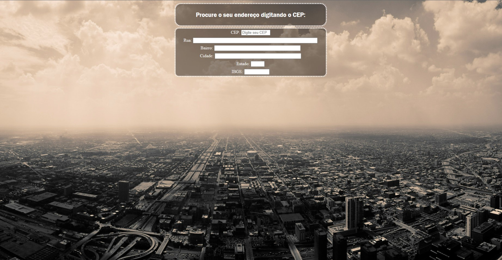
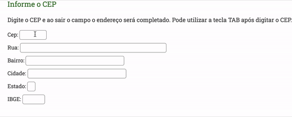

# CONSUMING APIS

;

## Objectives
+ ​O usuário deverá digitar o CEP e quando chegar no valor de 8 digitos ou fizer o evento blur, deverá ser preenchido todos os campos, automaticamente, com o endereço completo do usuário.
+ Entendendo: ​A API retornará os valores que devem ser inseridos nos campos, conforme na imagem.​ 
;


## Intro

Criamos os campos do formulário no html e realizamos via Javascript, uma requisição tipo GET  com a API ViaCEP - (https://viacep.com.br/), para obter, através da digitação do CEP, os valores dos campos destinados com o auto-preenchimento conforme a imagem do exemplo.

## CSS - SASS

Utilizamos um estilo básico com o sass para deixar a experiência do usuário mais convidativa e dinâmica. 

## JAVASCRIPT

Foram criadas funções e seu valores para absorção/limpeza dos dados do formulário e a função de callback dos conteúdos para possíveis erros de digitação. Em seguido atribuimos e encaminhamos o seguinte código para chamar o script da ViaCEP, com o uso preliminar do JSON:

```javascript

function pesquisacep(valor) {

    let cep = valor.replace(/\D/g, '');

    if (cep != "") {

        let validacep = /^[0-9]{8}$/;

        if (validacep.test(cep)) {

            document.getElementById('rua').value = "...";
            document.getElementById('bairro').value = "...";
            document.getElementById('cidade').value = "...";
            document.getElementById('uf').value = "...";
            document.getElementById('ibge').value = "...";

            let script = document.createElement('script');

            script.src = 'https://viacep.com.br/ws/' + cep + '/json/?callback=meu_callback';

            document.body.appendChild(script);

        } else {
            limpa_formulário_cep();
            alert("Formato de CEP inválido.");
        }
    } else {
        limpa_formulário_cep();
    }
};

```

## Observações

Esse foi mais aprofundamentos nos estudos do JavaScript. Vamos seguindo avançando e buscando aprender com os erros e potencializando os acertos.  